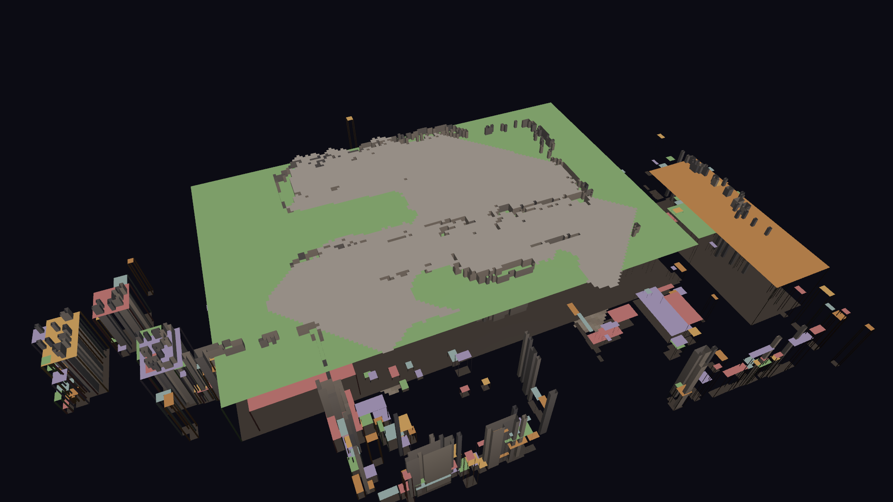

# 🐕 Robodog 3D — LiDAR Space Reconstruction

Interactive Three.js viewer for a LiDAR-reconstructed indoor space from a **Unitree Go2** robot dog.

## 🚀 [Live Demo](https://qwadratic.github.io/robodog-3d/)



## What is this?

A robot dog walked through an indoor space for 4 minutes with a solid-state LiDAR (15 Hz, 41.5M points total). From that single scan, we reconstructed a 3D architectural model and deployed it as an interactive first-person walkthrough.

### Pipeline

1. **Raw data**: 2GB MCAP file (ROS2 rosbag) → 41.5M deskewed LiDAR points + SLAM odometry
2. **Downsample**: 1cm voxel grid → 2.16M unique points
3. **Classify**: surface normals + height span → floor / wall / ceiling / furniture
4. **Reconstruct**: height-filtered walls (only floor-to-ceiling surfaces), flat floor/ceiling, schematic furniture
5. **Export**: GLB model + minimap + robot trajectory → Three.js viewer

### Features

- **979 wall cells** — height-filtered: only surfaces spanning floor-to-ceiling are walls
- **Greedy meshing** — adjacent wall faces merged into flat planes (not Minecraft blocks)
- **Occupancy probability** — wall brightness reflects LiDAR confidence (bright = many hits)
- **289 furniture objects** — schematic: floor shadows + wireframe edges + top cap
- **Robodog replay** — animated Go2 model replays the original 4-minute walk
- **Minimap** with real-time position + FOV cone
- **Screenshot capture** (F2) — saves PNG via download dialog
- **Point cloud overlay** (P) — 2.16M points, lazy-loaded on demand

## 🎮 Controls

| Key | Action |
|-----|--------|
| **Click** | Lock mouse (enter first-person) |
| **WASD** | Move |
| **Mouse** | Look around |
| **Shift** | Sprint |
| **R** | Toggle robodog replay (original trajectory) |
| **P** | Toggle point cloud overlay (loaded on demand) |
| **F2** | Save screenshot as PNG |
| **ESC** | Release mouse |

## Tech

- Single `index.html` — no build step
- Three.js 0.172.0 from CDN (importmap + modulepreload)
- PointerLockControls for first-person navigation
- Assets loaded in parallel with `<link rel="preload">`
- Point cloud lazy-loaded only on P key press
- Total payload: ~4MB

## Data source

- **Robot**: Unitree Go2 quadruped
- **LiDAR**: Unitree L1 solid-state, 15 Hz
- **Recording**: 4 minutes, 39.8m path, ~38m² covered
- **Format**: MCAP (ROS2 rosbag2, libmcap 1.3.1)

## Reconstruction scripts

The `scripts/` folder contains the Python pipeline that generates the 3D model from raw LiDAR data:

| Script | Purpose |
|--------|--------|
| `extract_floorplan.py [resolution]` | Read MCAP, accumulate 41.5M points, downsample (default 1cm), save NPZ |
| `build_clean_model.py` | Height-filter walls, greedy mesh, probabilistic coloring, schematic furniture |

Requires: `pip install open3d mcap mcap-ros2-support scipy numpy matplotlib pillow`

```bash
# Full pipeline
cd robodog-telemetry
python scripts/extract_floorplan.py 0.01   # 1cm voxel downsample
python scripts/build_clean_model.py         # → model.glb + minimap
```

## Local development

```bash
git clone https://github.com/qwadratic/robodog-3d.git
cd robodog-3d
python3 -m http.server 8000
# Open http://localhost:8000
```

---

*Built by [@qwadratic](https://github.com/qwadratic) • [GitHub](https://github.com/qwadratic/robodog-3d)*
